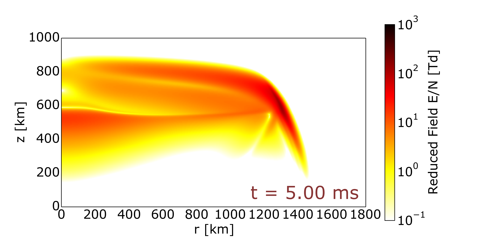

User guide
==========

Introduction
------------

What is grempy?
^^^^^^^^^^^^^^^

``grempy`` (GRanada ElectroMagnetic PYthon simulator) is a pure Python Finite-Differences Time-Domain (`FDTD <http://en.wikipedia.org/wiki/Finite-difference_time-domain_method>`_) electromagnetic solver.  Its main purpose is the study of the interactions between a lightning-generated electromagnetic pulse (EMP) and the upper layers of planetary atmospheres.

The code was developed by Alejandro Luque at the 
`Instituto de Astrofísica de Andalucía <http://www.iaa.es>`_ (IAA), `CSIC <http://www.csic.es>`_ and is released under the `GPLv2 <http://www.gnu.org/licenses/gpl-2.0.html>`_ license.  

Although many good and open source general-purpose FDTD codes are available, 
such as MIT's `Meep <http://ab-initio.mit.edu/wiki/index.php/Meep>`_,
``grempy`` has the more restricted purpose of simulating the propagation of the EMP generated by a lightning stroke and its interaction with the lower ionosphere.  This process is the responsible of so-called *ELVEs* (Emissions of Light and Very low frequency perturbations due to Electromagnetic pulse sources).
Elves are expanding, ring-shaped light emissions located at about 100 km altitude, centered above the originating lightning and lasting less than or about 1 ms.
Restricting its domain, ``grempy`` is easier to use than general-purpose FDTD solvers.

Some features of ``grempy`` are:

  * Self-consistently solves the Langevin (or modified Ohm equation) with an 
    altitude-dependent mobility.
  * Incorporates non-linear processes such as local changes in the ambient 
    conductivity due to impact-ionization.
  * The properties of the atmosphere where the EMP propagates are easily 
    specified with text files that specify the altitude profiles of 
    background gas density and initial electron density.  The nonlinear 
    response of the electron density is also specified by an external file.
    See section `Defining an atmosphere`_
  * A plug-in system permits the extension of the code with simple Python 
    modules.  This can be used, for example, to simulate additional chemical 
    processes.

Installation
------------

Required Python libraries
^^^^^^^^^^^^^^^^^^^^^^^^^

``grempy`` uses some Python libraries for the numerical computations as well
as its output format and plotting.  You have to have them installed and
accesible to run ``grempy``:

  * NumPy and SciPy.  See `here <http://scipy.org/install.html>`_ for installation instructions for your operating system.
  * `Matplotlib <http://matplotlib.org/>`_
  * `h5py <http://code.google.com/p/h5py/>`_
  * `pyYAML <http://pyyaml.org/>`_

For Linux and Mac OS X we recommend using the package repositories of your
distribution or MacPorts/Homebrew for Macs.

Installation
^^^^^^^^^^^^

You can fetch the latest version of ``grempy`` from github using::

  git clone https://github.com/aluque/grempy.git

This will download the required files into your current folder.  
Since ``grempy`` 
is written 100% in python, you do not need any additional compilation or instalation.

Running a simulation
--------------------

Once the code is set up, you use the script ``em.py`` to start a 
simulation::

  python /path/to/em.py simulation.yaml

where the file ``simulation.yaml`` contains the input parameters of the 
simulation.  See :doc:`parameters` for a list of all valid parameters with a
short description.

Input files
-----------

Input files for the code are ``.yaml`` files with key/value pairs.  
The YAML format is a light-weight serialization format.  You can obtain more
information about this format at `yaml.org <http://yaml.org/>`_.

``grempy`` expects an input file formed by key/value pairs specified as::
  
  key: value

Here is an of an input file for grempy::

  #
  #  FILES AND DIRECTORIES
  #
  #  The directory that contains extra input files. 
  input_dir: /your/input/folder/earth/
  
  #  A file to read the gas density from in h[km] n[cm^3]. 
  gas_density_file: gas.dat
  
  #  A file to read the electron density from in h[km] n[cm^3]. 
  electron_density_file: electrons.dat
  
  #  File with the ionization rate
  ionization_rate_file: ionization.dat
  
  
  #
  #  SIMULATION DOMAIN
  #
  #  Radius of the simulation domain in km. 
  r: 400.0
  
  #  Lower boundary of the simulation in km. 
  z0: 0.0
  
  #  Upper boundary of the simulation in km. 
  z1: 110.0
  
  #  Number of cells in the r direction.
  r_cells: 400
  
  #  Number of cells in the z direction.
  z_cells: 110
  
  #
  #  TIMES
  #
  #  The time step in seconds. 
  dt: 1e-07
  
  #  The final simulation time.
  end_t: 0.050
  
  #  The time between savings in seconds. 
  output_dt: 1e-04
  
  #
  #  CURRENT SOURCE
  #
  #  The Charge transferred in C.
  Q: 150.0
  
  #  With of the source in km. 
  r_source: 1.0
  
  #  Lower edge of the source in km. 
  z0_source: 0.0
  
  #  Upper edge of the source in km. 
  z1_source: 10.0
  
  #  Rise time of the stroke in seconds
  tau_r: 1e-3
  
  #  Fall (decay) time of the stroke in seconds
  tau_f: 2e-3
  
  
  #
  #  GAS PROPERTIES
  #
  #  Mobility times N in SI units. 
  mu_N: 1.2e+24
  
  
  #
  #  BOUNDARY CONDITIONS
  #
  #  Number of cells in the convoluted perfectly matching layers.
  ncpml: 10
  
  # Lower boundary condition.  Use 0 for a cpml, != 0 for an electrode 
  lower_boundary: 1
  
  #
  #  TRACKING OF THE FIELDS AT SOME POINTS
  #
  track_r: [40, 50, 60, 80, 100]
  track_z: [50, 51, 52, 53, 54, 55, 56, 57, 58, 59,
            60, 61, 62, 63, 64, 65, 66, 67, 68, 69,
            70, 71, 72, 73, 74, 75, 76, 77, 78, 79,
            80, 81, 82, 83, 84, 85, 86, 87, 88, 89]
  
  
Defining an atmosphere
----------------------

``grempy`` makes it easy to specify the properties and initial state of the 
atmosphere where the EMP is propagating.  The input parameter ``input_dir`` helps the user to organize different input conditions into separate folders.  All filenames are relative to the folder indicated by ``input_dir``.  In the distributed code we include samples of three planetary atmospheres: for Earth, Jupiter and Saturn.

The profile of background gas density as a function of altitude is read from the file specified in the parameter ``gas_density_file``.  The file must contain two columns, the first one is altitude in kilometers; the second is the gas density in cm\ :superscript:`-3`.

An additional file provides the initial electron density as a function of altitude.  The name of this file is read from the parameter ``electron_density_file``.  The format is the same as above: two columns, the first one is altitude in kilometers; the second is the electron density in cm\ :superscript:`-3`.

The background gas composition influences the propagation of electromagnetic waves first by setting the electron mobility and second by setting a rate of ionization as a function of reduced electric field.  The mobility is specified in the parameter ``mu_N``.  This must give, in SI units, the electron mobility :math:`\mu` times the background gas density :math:`n`.  The product of the two is assumed to be constant.

The ionization rate is read from the file specified in the parameter ``ionization_rate_file``, that must contain two columns: a reduced electric field 
:math:`E/n` in Townsend (1 Td = 10\ :superscript:`17` V cm\ :superscript:`2`).
and an ionization rate in m\ :superscript:`3`/s. 

Output files
------------

The code produces a single output file per simulation.  The name of the output file is constructed by replacing ``.yaml`` for ``.h5`` in the input file name.
The output is a 
`HDF5 <http://www.hdfgroup.org/HDF5/>`_ file, organized as follows:

The root group of the HDF5 file contains
attributes containing the input parameters used in the simulation as well
as information about the running environment encoded into atributes that 
start and end with underlines:

``_command_``
   The command that was used to start the simulation.

``_timestamp_``
   The machine time when the simulation was started.

``_ctime_``
   Human-readable version of ``_timestamp_``.

``_cwd_``
   The current directory when the program was run.

``_user_``
   Login name of the user that run the simulation.

``_host_``
   The name of the computer where the simulation run,

In the root group we also store this information for efficiency reasons:

``box``
   An array specifying the simulation domain (r0, r1, z0, z1).

``dim``
   An array containing the number of cells in the r- and z-directions.

``ngas``
   An array with the gas density depending on the altitude.

Each time-step is saved as a sub-group of a ``steps`` group, with names
``00000``, ``00001`` and so forth.  For every step we save the following 
data, all of it using SI units.

``te`` (attribute)
   The time at which the electric field is saved.

``th`` (attribute)
   The time at which the magnetic field is saved.

``timestamp`` (attribute)
   Machine time when the snapshot was saved.

``er``, ``ez``, ``ephi`` (datasets)
   The components of the electric field, stored as 2d arrays (r-index, z-index).

``hr``, ``hz``, ``hphi`` (datasets)
   The components of the magnetic field, stored as 2d arrays (r-index, z-index).

``ne`` (dataset)
   The density of free electrons, also as a 2d array.

``j`` (dataset)
   The current density, also as a 2d array.

Besides, each snapshot contains also information about the status of the 
CPML included in the simulation.  They are stored as sub-groups of each timestep
with names ``cpml_000``, ``cpml_001``, ...

Plotting
--------

The script ``plotter.py`` can be used to plot the results of a 
simulation for a quick inspection.  Use it as:

.. argparse::
   :module: plotter
   :func: get_parser
   :prog: python plotter.py

In the above, ``{rid}`` refers to the *run identifier*, which is the input filename stripped of the ``.h5`` extension, ``{step}`` refers to the plotted step (e.g. ``0013``) and ``{var}`` to the plotted variable.

Some of the possible variables to plot are:

``eabs`` 
   Absolute value of the electric field.

``en`` 
   Reduced Field :math:`E/n`.

``er`` 
   *z* component of the electric field.

``ez`` 
   *z* component of the electric field.

``ne`` 
   Electron density.

``jr`` 
   *r* component of the current density.

``jz`` 
   *z* component of the current density.

``photons`` 
   Integrated photon emissions (if available)

``energy`` 
   Deposited energy density [$\mathdefault{J m^{-3}}$]

``max_eabs`` 
   Highest electric field at each point

``max_en``
   Highest Reduced Field :math:`E/n` at each point.

If `--show` is given, the program will open a matplotlib window; otherwise 
a ``.png`` file will be saved as specified by ``--output`` and ``--outdir``.

For example, tlot the reduced electric field at step 0010 of a simulation file 
``output.h5``, plotting *r* from 0 to 1800 km and *z* from 0 to 1000 km,
using a logarithmic colorscale from 10\ :superscript:`-1` to 
10\ :superscript:`3` Td use::

     python plotter.py output.h5 en 0010 --log --rlim=0:1800 --zlim=0:1000 --clim=1e-1:1e3

That produces the following output:

